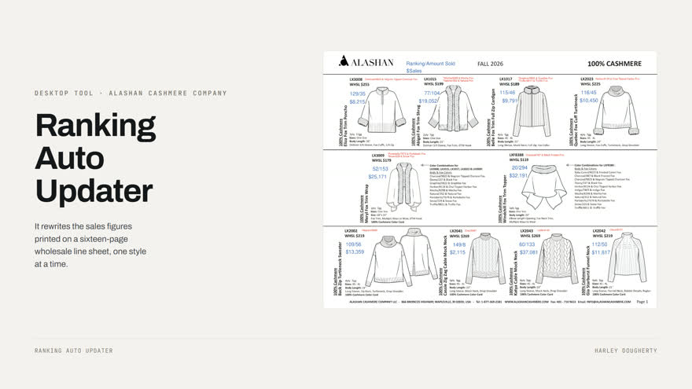
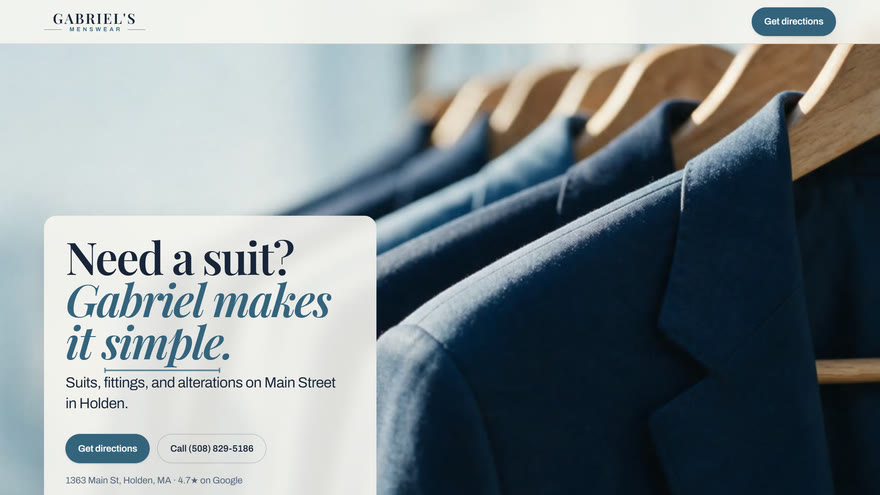
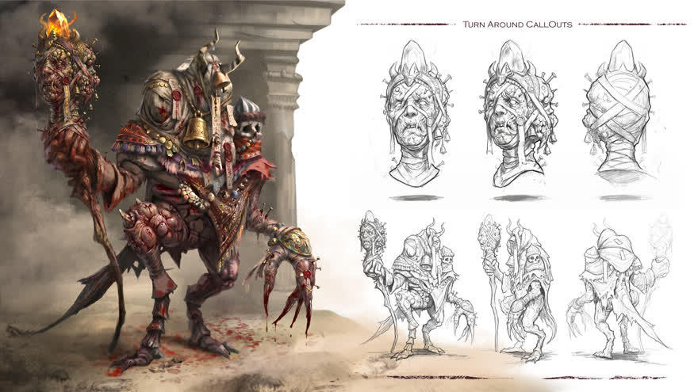

## Harley Dougherty

Creative technologist. I trained as a concept artist and 3D modeller, spent years making
characters, creatures and environments, and then started building the tools instead.

That turned out to be the same job. A generation pipeline is art direction with a type
system. A line sheet that updates itself is typography with a test suite. What follows runs
both ways: hand-sculpted design on one side, production software on the other.

Based in Massachusetts.

---

### Luvley.ai

An AI image studio, live at [luvley.ai](https://luvley.ai). Plenty of products will generate
you an image, and that part is a model call. The rare part is a copywriting system built on
top of image-to-image that a non-technical person can steer: fix the one thing that came out
wrong without losing the rest of the picture, then get the words to run beside it. Taking
payments, built and run by one person.
It began as a 467-node ComfyUI graph, published in full alongside the case study.

**[Read the case study →](https://github.com/harleydoughertyart-sketch/luvley)**

---

### Line Sheet Updater: PDF surgery for a wholesale line sheet

A desktop tool for Alashan Cashmere Company. It rewrites the sales figures printed on a
sixteen-page line sheet without disturbing the layout an art director signed off on, and
makes a person confirm every one, because the only real failure mode is a plausible wrong
number.

**[Read the case study →](https://github.com/harleydoughertyart-sketch/linesheet-updater)**

---

### Gabriel's Menswear: scroll as the timeline

A menswear shop on Main Street in Holden. Scrolling drives the page: video scrubs frame by
frame under the wheel, sections pin while their copy advances, and a rail of occasions pans
sideways as you travel down. The engine underneath is 1,167 lines of vanilla JavaScript with
no dependencies, driven by `data-sc-*` attributes on ordinary markup, and the whole source is
public.

The shop still has to do its job. Someone lands on a phone needing a funeral suit for
tomorrow, so the number stays one tap away, and reduced motion gets a real version of the
page that never fetches a clip at all.

**[Read the case study →](https://github.com/harleydoughertyart-sketch/gabriels-menswear)**

---

### Concept art and 3D

Character, creature and environment design. Sculpting, texturing, turnarounds, presentation.

**[More on ArtStation →](https://www.artstation.com/harleydougherty1)**

---

> Luvley and the Alashan tool are commercial work, so their full source stays private. Each
> case study below shows the real software running, and publishes the modules worth reading.

### What I work with

**Building things people use:** TypeScript, React, Node, Python, Express, Firebase, Stripe,
Cloud Run, Playwright

**Making pictures:** Blender, ZBrush, Substance Painter, Plasticity, Photoshop, DaVinci
Resolve

**Working with models:** the OpenAI and Gemini APIs, prompt systems, multi-agent
orchestration, evaluation harnesses

---

Reach me at [harleydoughertyart@gmail.com](mailto:harleydoughertyart@gmail.com).

